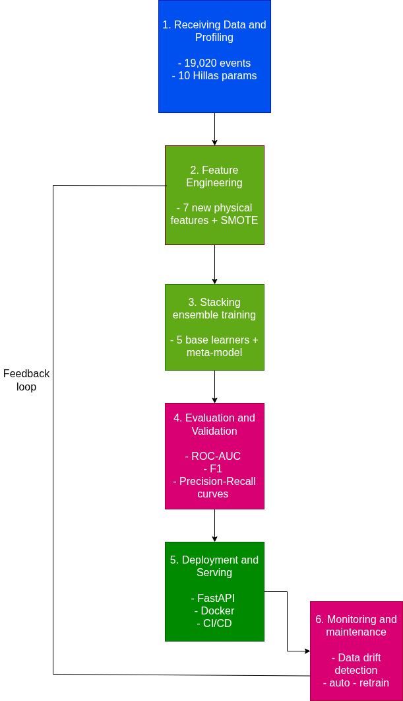
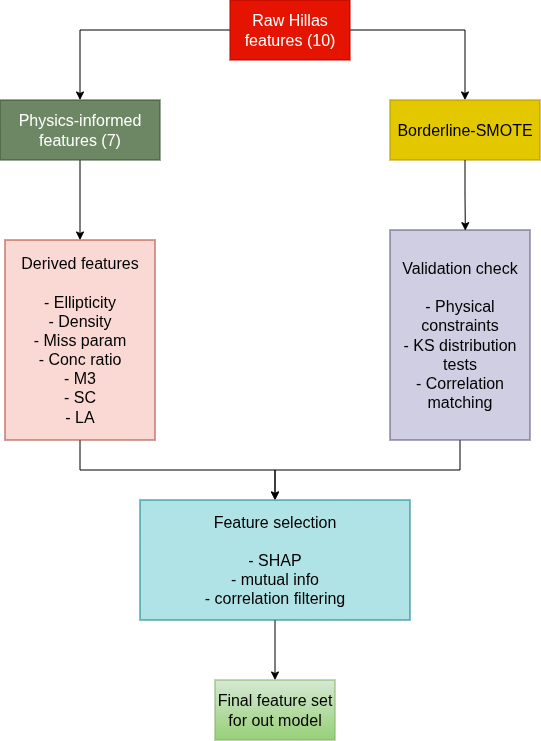
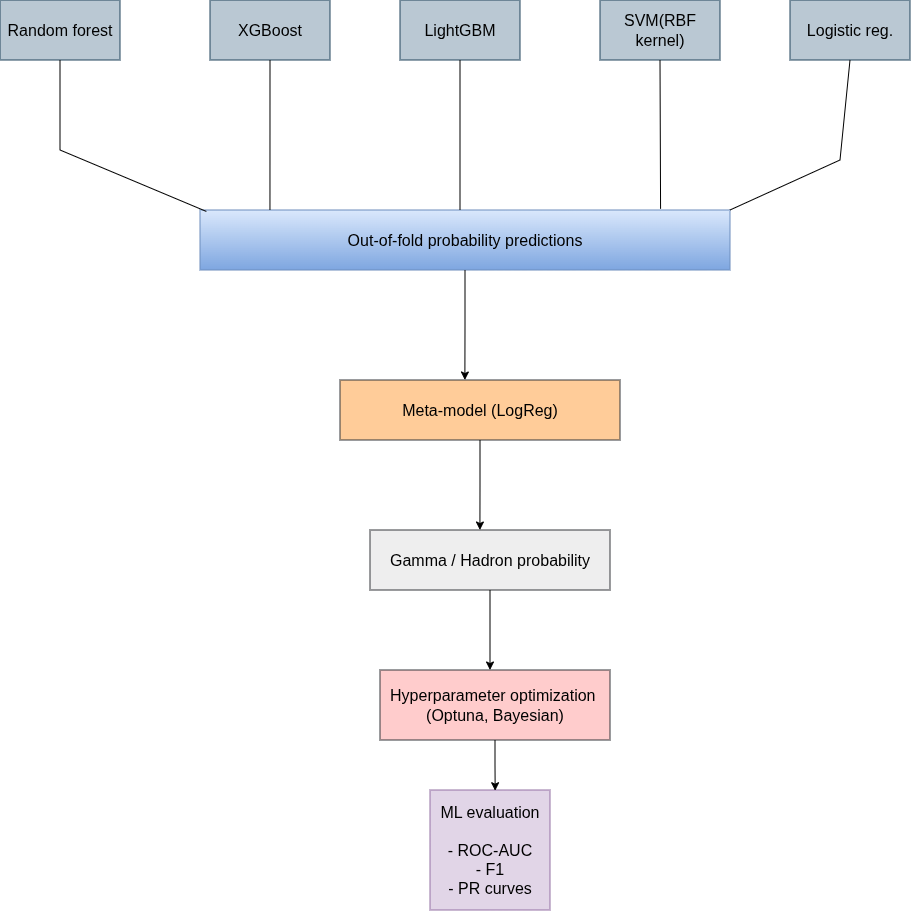
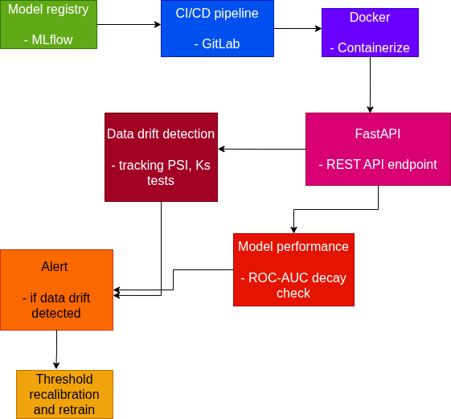

# MAGIC Gamma Telescope — ABK team final project for ML

### Background: What Are We Looking At?

The MAGIC telescope detects **Cherenkov radiation** — flashes of blue light produced when gamma rays from deep space strike Earth's atmosphere, creating cascading particle showers. The telescope's camera captures an image of each shower, and a Principal Component Analysis reduces that image to an **ellipse** described by the 10 Hillas parameters in our dataset.

The fundamental challenge: **gamma-ray showers** (signal) and **hadronic showers** (background cosmic rays) both produce Cherenkov light, but their ellipse shapes differ because of the underlying physics. Gamma showers are electromagnetic — clean, narrow, and aligned toward the source. Hadronic showers involve nuclear interactions — messier, wider, and randomly oriented.

Our raw features describe this ellipse:

| Feature    | Physical Meaning                                                                 |
| ---------- | -------------------------------------------------------------------------------- |
| `fLength`  | Major axis of the ellipse (mm) — lateral spread of the shower                    |
| `fWidth`   | Minor axis of the ellipse (mm) — vertical development of the shower              |
| `fSize`    | log₁₀ of total photon count — proxy for primary particle energy                  |
| `fConc`    | Ratio of two brightest pixels to total — light concentration                     |
| `fConc1`   | Ratio of single brightest pixel to total — peak concentration                    |
| `fAsym`    | Distance from brightest pixel to center along major axis (mm) — shower asymmetry |
| `fM3Long`  | 3rd moment along major axis (mm) — longitudinal skewness of light distribution   |
| `fM3Trans` | 3rd moment along minor axis (mm) — transverse skewness                           |
| `fAlpha`   | Angle between major axis and line to camera center (deg) — orientation           |
| `fDist`    | Distance from camera center to ellipse center (mm) — impact parameter proxy      |

---

### Engineered Features

| Feature                   | Formula                    | Physical Principle    | Gamma Signature      | Hadron Signature    |
| ------------------------- | -------------------------- | --------------------- | -------------------- | ------------------- |
| Ellipticity (ε)           | fLength / fWidth           | EM cascade geometry   | Elongated (high ε)   | Rounder (low ε)     |
| Shower Density (ρ)        | fSize / (fLength × fWidth) | Energy concentration  | Dense (high ρ)       | Diffuse (low ρ)     |
| Miss Parameter            | fDist × sin(fAlpha)        | Source directionality | Near zero            | Random, larger      |
| Concentration Ratio (κ)   | fConc / fConc1             | Core light profile    | ~1.0 (single peak)   | ~1.5–2.0 (multiple) |
| 3rd Moment Magnitude (M3) | √(M3Long² + M3Trans²)      | Shower asymmetry      | Moderate, consistent | Extreme, variable   |
| Size–Concentration (SC)   | fSize × fConc              | Energy compactness    | High                 | Lower               |
| Longitudinal Asym. (LA)   | fAsym / fLength            | Shower max position   | Consistent           | Stochastic          |

---

## Justification for Synthetic Data Generation

### The Problem

The MAGIC dataset has ~12,330 gamma events and ~6,690 hadron events (~65%/35% split). The UCI documentation states: _"For technical reasons, the number of h events is underestimated. In the real data, the h class represents the majority of the events."_ This means our dataset has a **reversed class imbalance** compared to real telescope operations, where hadrons outnumber gamma events by a factor of ~10,000:1.

### Why SMOTE-Based Synthetic Generation Is Physically Justified Here

#### 1. The Data Is Already Synthetic-Adjacent

The original Hillas parameters are themselves derived from Monte Carlo simulations and processed camera images — they are statistical summaries (variance and skewness of a 2D light distribution), not raw physical measurements. The entire MAGIC analysis pipeline already relies on simulated gamma-ray showers (generated by CORSIKA atmospheric simulation codes) to train its classifiers. So using SMOTE is somewhat okay for us

#### 2. Continuous Features Suits Linear Interpolation

SMOTE works by linearly interpolating between neighboring minority-class samples in feature space. All 10 Hillas parameters are continuous variables derived from geometric and photometric properties of an ellipse. Linear interpolation between two physical shower events produces a point that represents a plausible intermediate shower — one with slightly different energy, slightly different impact parameter, or slightly different atmospheric depth. There are no categorical features or discrete constraints that interpolation would violate.

#### 3. Physical Constraint Validation

After generating synthetic samples, we can validate them against known physical constraints:

- `fLength > 0` and `fWidth > 0` (shower images have positive extent)
- `fLength ≥ fWidth` (major axis ≥ minor axis by definition)
- `0 ≤ fConc ≤ 1` and `0 ≤ fConc1 ≤ 1` (concentration ratios are bounded)
- `fConc ≥ fConc1` (two pixels ≥ one pixel)
- `0 ≤ fAlpha ≤ 90` (angle is bounded)
- `fDist > 0` (distance is positive)

Any synthetic sample violating these constraints is discarded. This post-generation filtering ensures that the physics part is satisfied

#### 4. Addressing the Real-World Imbalance

In real MAGIC operations, the hadron-to-gamma ratio is approximately 10,000:1. Our dataset's ~2:1 gamma-majority is an artifact of the data collection process (pre-filtered and curated). By generating synthetic hadron samples, we move the training distribution closer to what the deployed system would actually encounter, improving generalization to real telescope data

#### 5. Borderline-SMOTE + Physical Filtering

We are thinking to choose Borderline-SMOTE specifically because:

- It focuses synthetic generation on the decision boundary — the samples that are hardest to classify — rather than wasting computation on easy interior points.
- In physics terms, these borderline samples represent showers with ambiguous characteristics (e.g., a high-energy hadron that happens to produce a narrow, gamma-like cascade). These are exactly the cases where more training data is most valuable.
- Combined with post-generation physical constraint checking, this produces samples that are both statistically useful (they improve decision boundaries) and physically plausible (they satisfy known Hillas parameter relationships).

### What We Must Verify

To claim the synthetic data is "suitable as real data," we need to demonstrate:

1. **Distribution preservation:** KS tests and QQ plots showing synthetic feature distributions match original distributions.
2. **Correlation preservation:** Pairwise correlation matrices of synthetic vs. original data should be similar.
3. **Physical validity:** 100% of synthetic samples pass the constraint checks listed above.
4. **No data leakage:** SMOTE is applied only within training folds during CV, never on test data.
5. **Performance improvement:** The model trained with synthetic data should outperform one without it on the held-out test set. We will focus on F1-score,ROC-AUC and Precision-Recall curves metrics

---

## Why in particular those metrics

It's cause of given the imbalanced classes and the astrophysics context (we don't want to miss real gamma events but also don't want false alarms flooding the pipeline). Thus, those metrics suit our task the best

---

## Why our project is relevant

The standard approach in the field uses these Hillas parameters with Random Forest classifiers (this is what MAGIC actually uses in production).We are

- creating physics-informed features that encode relationships the raw parameters don't explicitly capture .
- using synthetic data generation to better represent the true hadron-dominated environment the telescope operates in.
- using a stacking ensemble that can learn complementary patterns from diverse model architectures — something a single Random Forest can't do

---

## Methodology diagram

### 1. Overview

### 2. Feature Engineering Pipeline

### 3. Stacking Ensemble

### 4. Deployment and Monitoring

---

## Key points

**Novelty:**

- Physics-informed feature engineering (not just statistical transforms — each feature has a physical derivation rooted in Cherenkov shower physics)
- Physically-validated synthetic data generation (not blind SMOTE — constraint checking ensures plausibility)
- Stacking ensemble with physics features fed to both base learners AND meta-learner

**Deployment & Maintainability:**

- Containerized inference via FastAPI + Docker
- Model versioning through MLflow
- Automated retraining triggered by data drift detection (we can track PSI on incoming telescope data and ROC-AUC decay) , if detected -> threshold recalibration -> retraining pipeline -> redeploy

**AutoML:**

- Optuna for Bayesian hyperparameter optimization across all base learners and regularization of a meta-model
- Automated feature selection via SHAP importance ranking / also may be use mutual information , correlation filtering

---

### Tools Stack Summary

| Layer                 | Tools                               |
| --------------------- | ----------------------------------- |
| Data versioning       | Git                                 |
| Feature engineering   | pandas, NumPy, scikit-learn         |
| Synthetic data        | imbalanced-learn (Borderline-SMOTE) |
| Model training        | scikit-learn, XGBoost, LightGBM     |
| Experiment tracking   | MLflow                              |
| Hyperparameter tuning | Optuna                              |
| API serving           | FastAPI                             |
| Containerization      | Docker                              |
| Monitoring            | custom dashboards                   |
| CI/CD                 | Github Actions(MAYBE) or GitLab     |
